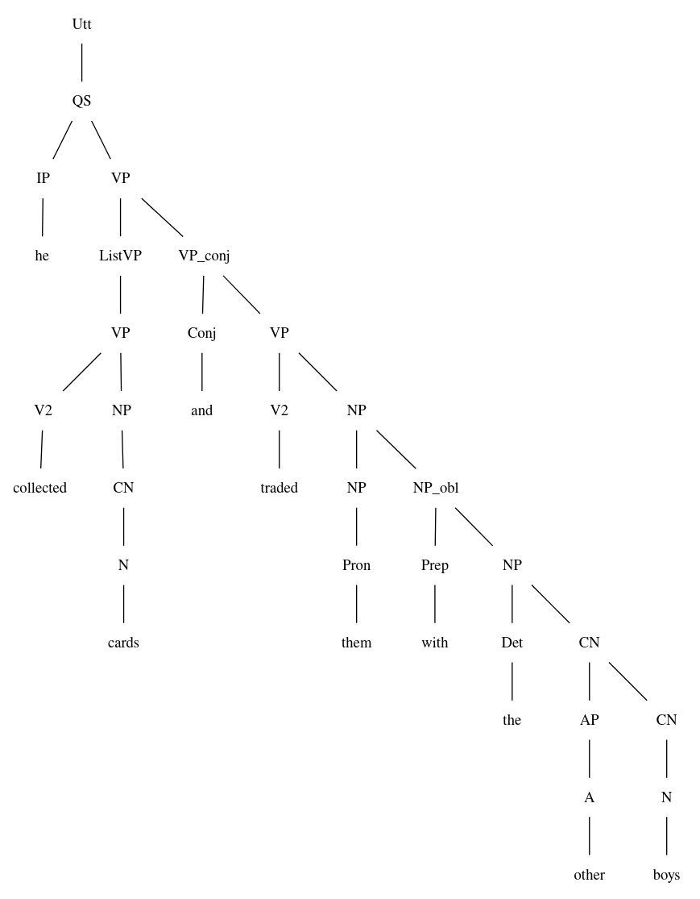
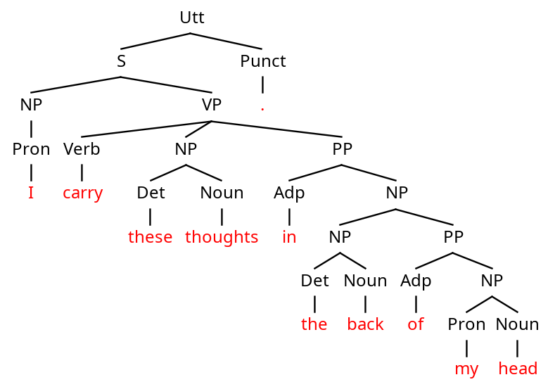

# Evaluation
The lexicon in the .dbnf files sometimes generated conflicts with the POS-tagged sentences. So, I removed the lexicon completely from both the English and the Swedish .dbnf files and relied solely on the POS tags.

## parse trees
### "A small town with two minarets glides by."
#### **English**
| manual                             | generated                             |
|------------------------------------|---------------------------------------|
|||

Both parse trees look quite similar in their structure. The differences consist of different naming of some nodes (I used *PP* instead of *NP_obl*) and the level detail for some trees. In my own trees, I used shortcuts for e.g. the *CN*. My rules allow the construction of the *CN* directly with a *Noun*, while the generated rules require another *CN*, which itself consists of a single *Noun*. The same applies to the *NP*, *VP* or *Num*.

#### **Swedish**
| manual                             | generated                             |
|------------------------------------|---------------------------------------|
|||

My manual Swedish tree has the exact same structure as the English tree. The generated tree on the other hand didn't work perfectly. It reads the word *förbi* as a negation instead of a general adverb. Apart from that, the same simplifications explained for the English trees above also apply here.

### "It was just a boy with muddy shoes."
#### **English**
| manual                             | generated                             |
|------------------------------------|---------------------------------------|
|||

Also here, the general structure of both trees is the same and again, I used some simplifications.
Nonetheless, gfud parsed the sentence wrongly as a question. Furthermore, it read the word *just* as a negation instead of a general adverb. 

#### **Swedish**
| manual                             | generated                             |
|------------------------------------|---------------------------------------|
|||

The exact same observations also apply for the Swedish trees.

### "He collected cards and traded them with the other boys."
#### **English**
| manual                             | generated                             |
|------------------------------------|---------------------------------------|
|||

Interestingly, gfud parsed the sentence again as a question instead of a declarative sentence.
Apart from that, I made again some simplifications in my trees. One of these is also allowing nodes to have three children instead of being just binary (as in the gfud tree). I use the rule `VP ::= Verb NP PP` while gfud uses the rules `VP ::= V2 NP` and `NP ::= NP NP_obl`. This gives the trees a slightly different structure.

#### **Swedish**
| manual                             | generated                             |
|------------------------------------|---------------------------------------|
|||

The exact same observations also apply for the Swedish trees.

### "I carry these thoughts in the back of my head."
#### **English**
| manual                             | generated                             |
|------------------------------------|---------------------------------------|
|||

Looking at the right part of the sentence, the parses are despite the simplifications and renamings very similar. But gfud identified *carry* wrongly as a form of *to be* and *I* as its expletive subject. This leads to a wrong tree for the left part of the sentence as well as for the connection of *carry* to its objects.

#### **Swedish**
| manual                             | generated                             |
|------------------------------------|---------------------------------------|
|||

In Swedish, gfud parses the words correctly (maybe because I used *har* as the translation for *carry*). Therefore, the generated Swedish tree has almost the same structure as my own tree (apart from the simplifications).

Comparing it to the English sentence, the Swedish translation is also a lot simpler, since it condenses the whole phrase *the back of the head* into one word *bakhuvud*. This may have also helped gfud, to parse the sentence correctly.

## CoNLL-U trees
### English
#### English grammar (without lexicon)
```bash
❯ cat English_tagged_corpus.txt | gf-ud dbnf English_nolex.dbnf Utt > English.conllu
❯ gf-ud eval macro LAS ../assignment_3/English.conllu English.conllu
evaluating macro LAS ../assignment_3/English.conllu English.conllu
UDScore {udScore = 0.6616381642073342, udMatching = 22, udTotalLength = 307, udSamesLength = 199, udPerfectMatch = 2}
```

### Swedish
#### English grammar
```bash
❯ cat Swedish_tagged_corpus.txt | gf-ud dbnf Swedish_nolex.dbnf Utt > Swedish.conllu
❯ gf-ud eval macro LAS ../assignment_3/Swedish.conllu Swedish.conllu
evaluating macro LAS ../assignment_3/Swedish.conllu Swedish.conllu
UDScore {udScore = 0.5869486178309707, udMatching = 24, udTotalLength = 295, udSamesLength = 171, udPerfectMatch = 2}
```

#### adapted grammar
The word order and grammar in Swedish is quite similar to English. So the grammar already worked well. To bring the performance over 0.60, I introduced new rules to build the passive in Swedish. While in English one needs an auxiliary verb for the passive, in Swedish, it can also be done by inflecting the verb itself. Furthermore, I added rules for the negation, since in Swedish, there is no need for the auxiliary verb *do*. I added the following rules:
```haskell
S ::= NP VP_pass # nsubj:pass head
VP_pass ::= AdV? VP_pass NP # advmod head xcomp

VP ::= V neg? # head advmod
-- removed S ::= NP do neg VP  # nsubj aux advmod head
```

```bash
❯ cat Swedish_tagged_corpus.txt | gf-ud dbnf Swedish_nolex.dbnf Utt > Swedish.conllu
❯ gf-ud eval macro LAS ../assignment_3/Swedish.conllu Swedish.conllu
evaluating macro LAS ../assignment_3/Swedish.conllu Swedish.conllu
UDScore {udScore = 0.6362809644059643, udMatching = 24, udTotalLength = 295, udSamesLength = 183, udPerfectMatch = 2}
```